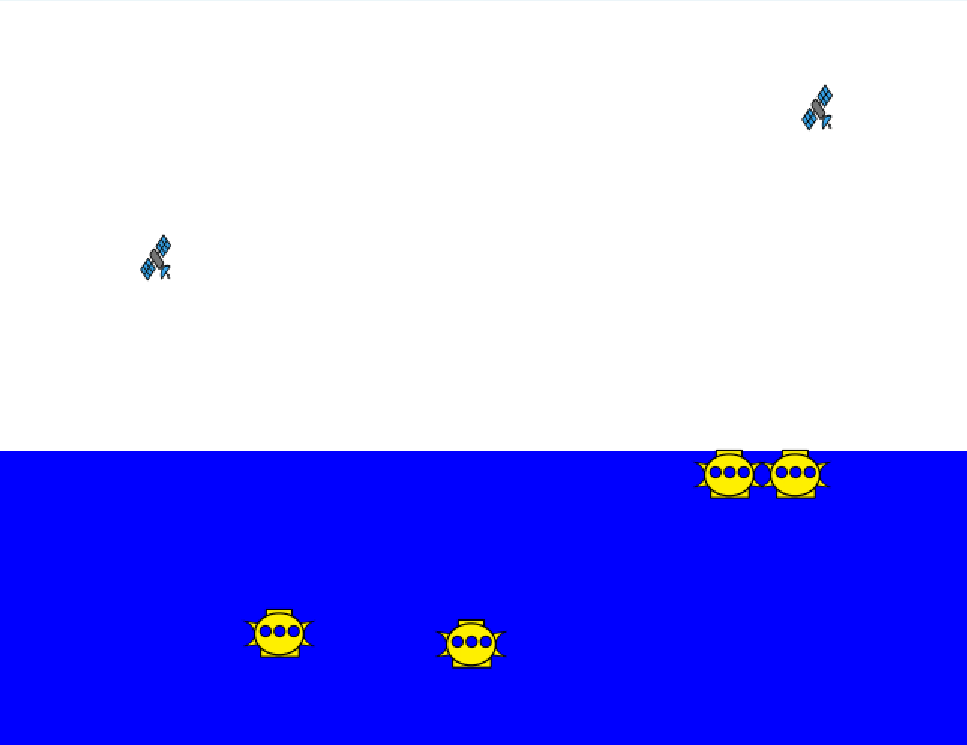
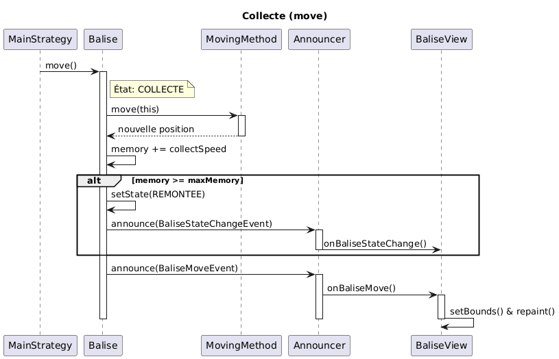
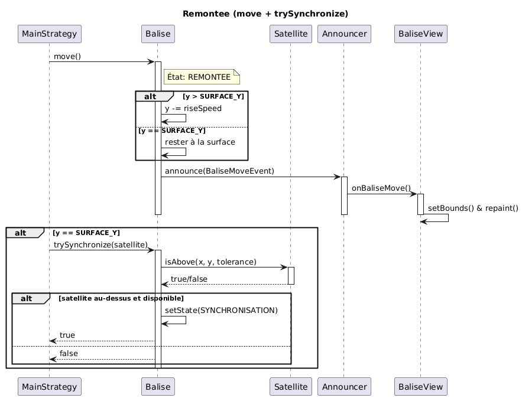
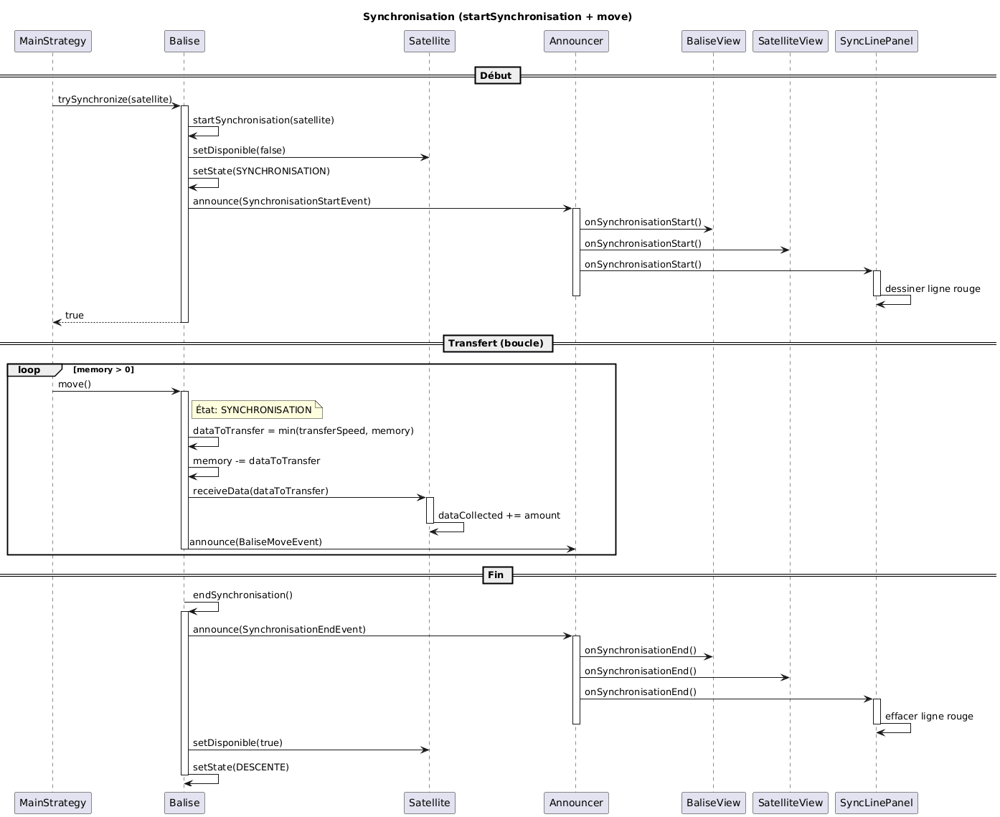
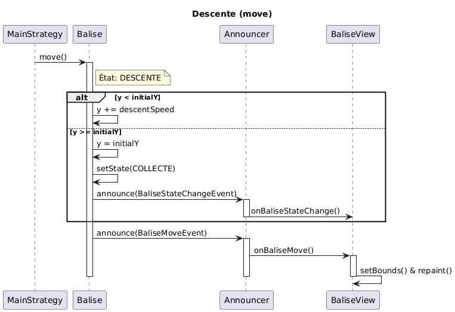

# Projet Balise-Satellite

## Vue d'ensemble

Simulation d'un système de collecte de données océanographiques par des balises autonomes communicant avec des satellites en orbite. Le projet met en œuvre **3 design patterns majeurs** pour gérer le cycle de vie des balises, leurs stratégies de mouvement et la communication événementielle.

---





---

## Organisation des Packages

```
src/
├── announcer/          # Pattern Observable - Gestion des événements
├── app/                # Point d'entrée et interface graphique
├── balise/             # Modèle des balises autonomes
├── method/             # Pattern Stratégie - Algorithmes de mouvement
└── satellite/          # Modèle des satellites
```

---

## Package `announcer` - Pattern Observable

### Rôle
Implémente le **Pattern Observable** (médiateur d'événements) permettant la communication découplée entre les modèles (Balise, Satellite) et les vues (BaliseView, SatelliteView).

### Classes

#### `Announcer`
**Description** : Gestionnaire central des événements. Maintient un registre des listeners et distribue les événements.


#### `AbstractEvent`
**Description** : Classe abstraite pour tous les événements. Utilise le **Double Dispatch Pattern**.

---

## Package `balise` - Modèle des Balises

### Rôle
Représente les balises océanographiques autonomes qui collectent des données et se synchronisent avec les satellites.

### Classes

#### `Balise`
**Description** : Balise autonome suivant un cycle en 4 phases (Pattern État). Contient son propre `Announcer` (composition).


#### `BaliseState` (Enum)
**Description** : États possibles d'une balise (Pattern État).

**Valeurs** :
- `COLLECTE` - Collecte de données en profondeur
- `REMONTEE` - Remontée vers la surface
- `SYNCHRONISATION` - Transfert de données au satellite
- `DESCENTE` - Retour à la profondeur initiale

#### `BaliseView`
**Description** : Vue graphique d'une balise. Implémente 2 interfaces de listener.

**Interfaces implémentées** :
- `BaliseListener` - Reçoit les événements de mouvement
- `BaliseStateListener` - Reçoit les événements de changement d'état
- 

### Événements

#### `BaliseMoveEvent`
**Description** : Événement émis à chaque déplacement de balise.

**Méthode** :
- `sentTo(Object)` - Transmet l'événement à `BaliseListener.onBaliseMove()`

#### `BaliseStateChangeEvent`
**Description** : Événement émis lors d'un changement d'état.

**Méthode** :
- `sentTo(Object)` - Transmet l'événement à `BaliseStateListener.onBaliseStateChange()`

#### `SynchronisationStartEvent`
**Description** : Événement émis au début d'une synchronisation.

**Méthode** :
- `sentTo(Object)` - Transmet à `SynchronisationListener.onSynchronisationStart()`

#### `SynchronisationEndEvent`
**Description** : Événement émis à la fin d'une synchronisation.


**Méthode** :
- `sentTo(Object)` - Transmet à `SynchronisationListener.onSynchronisationEnd()`

### Interfaces de Listener

#### `BaliseListener`
**Méthode** :
- `onBaliseMove(BaliseMoveEvent)` - Appelé à chaque mouvement de balise

#### `BaliseStateListener`
**Méthode** :
- `onBaliseStateChange(BaliseStateChangeEvent)` - Appelé à chaque changement d'état

#### `SynchronisationListener`
**Méthodes** :
- `onSynchronisationStart(SynchronisationStartEvent)` - Début de synchronisation
- `onSynchronisationEnd(SynchronisationEndEvent)` - Fin de synchronisation

---

## Package `satellite` - Modèle des Satellites

### Rôle
Représente les satellites en orbite qui se déplacent horizontalement et reçoivent les données des balises.

### Classes

#### `Satellite`
**Description** : Satellite en orbite avec mouvement horizontal et effet de boucle infinie (wrap-around).

#### `SatelliteView`
**Description** : Vue graphique d'un satellite. Implémente 1 interface de listener.

**Interface implémentée** :
- `SatelliteListener` - Reçoit les événements de mouvement


### Événements

#### `SatelliteMoveEvent`
**Description** : Événement émis à chaque déplacement de satellite.

**Méthode** :
- `sentTo(Object)` - Transmet à `SatelliteListener.onSatelliteMove()`

### Interfaces de Listener

#### `SatelliteListener`
**Méthode** :
- `onSatelliteMove(SatelliteMoveEvent)` - Appelé à chaque mouvement de satellite

---

## Package `method` - Pattern Stratégie

### Rôle
Implémente le **Pattern Stratégie** permettant de définir différents algorithmes de mouvement pour les balises de manière interchangeable.

### Implémentations

#### `LinearMethod`
**Description** : Mouvement linéaire horizontal à vitesse constante.

**Comportement** :
- Déplace la balise horizontalement selon sa direction
- Inverse la direction aux bords de l'écran (rebond)
- Vitesse : 2 pixels par cycle

#### `SinusoidalMethod`
**Description** : Mouvement sinusoïdal (oscillation verticale + déplacement horizontal).


#### `VerticalMethod`
**Description** : Mouvement vertical en yo-yo (monte et descend).


#### `StaticMethod`
**Description** : Pas de mouvement (balise fixe).


---

## Package `app` - Application et Interface

### Classes

#### `MainStrategy`
**Description** : Point d'entrée de l'application. Initialise et lance la simulation.


**Structure** :
1. Création de la fenêtre Swing
2. Création de 3 balises avec stratégies différentes :
   - Balise 1 : LinearMethod
   - Balise 2 : SinusoidalMethod
   - Balise 3 : VerticalMethod
3. Création de 2 satellites
4. Enregistrement des vues comme listeners
5. Boucle d'animation infinie (30ms)

#### `SynchronisationLinePanel`
**Description** : Panneau graphique affichant les lignes de connexion lors des synchronisations.

**Interface implémentée** :
- `SynchronisationListener` - Reçoit les événements de synchronisation


---

##  Design Patterns Utilisés

### 1. Pattern État (State Pattern)

### 2. Pattern Stratégie (Strategy Pattern)

### 3. Pattern Observable (Observer Pattern)

**Architecture** :
```
Modèle (Balise/Satellite)
    ↓ contient (composition)
Announcer
    ↓ announce(event)
AbstractEvent
    ↓ sentTo(listener)
Listener (BaliseView/SatelliteView)
    ↓ onEvent()
Mise à jour de la vue
```


---


## Diagrammes UML

### Diagramme d'architecture


Diagramme de classes complet montrant les 4 packages principaux (MODÈLE, VUE, CONTRÔLEUR, OBSERVABLE/OBSERVATEUR).

---

### Diagramme d'état


---
### Diagrammes de séquence

#### Phase COLLECTE



La balise se déplace en profondeur selon sa stratégie (Linear, Sinusoidal, Vertical, Static) et collecte progressivement des données océaniques. Quand la mémoire est pleine (memory >= maxMemory), elle passe automatiquement en état REMONTEE.

#### Phase REMONTEE



La balise remonte progressivement vers la surface (y -= riseSpeed) jusqu'à atteindre SURFACE_Y (290). Une fois à la surface, elle attend qu'un satellite disponible passe au-dessus. Si un satellite est détecté via `trySynchronize()`, elle passe en état SYNCHRONISATION.

#### Phase SYNCHRONISATION



La balise transfère ses données vers le satellite en 3 étapes : **Début** (satellite devient indisponible, ligne rouge apparaît), **Transfert** (boucle qui transfère progressivement memory -= transferSpeed), **Fin** (memory == 0, ligne rouge disparaît, satellite redevient disponible, passage en DESCENTE).

#### Phase DESCENTE



Après avoir transféré toutes ses données (memory == 0), la balise redescend progressivement vers sa profondeur initiale (y += descentSpeed). Une fois arrivée (y >= initialY), elle repasse en état COLLECTE et un nouveau cycle recommence.


---


## Auteurs

Projet réalisé dans le cadre du cours de Conception Objet - Master 2 TIIL-A par :
 - Naël ABASY
 - Aïcha AMINE
